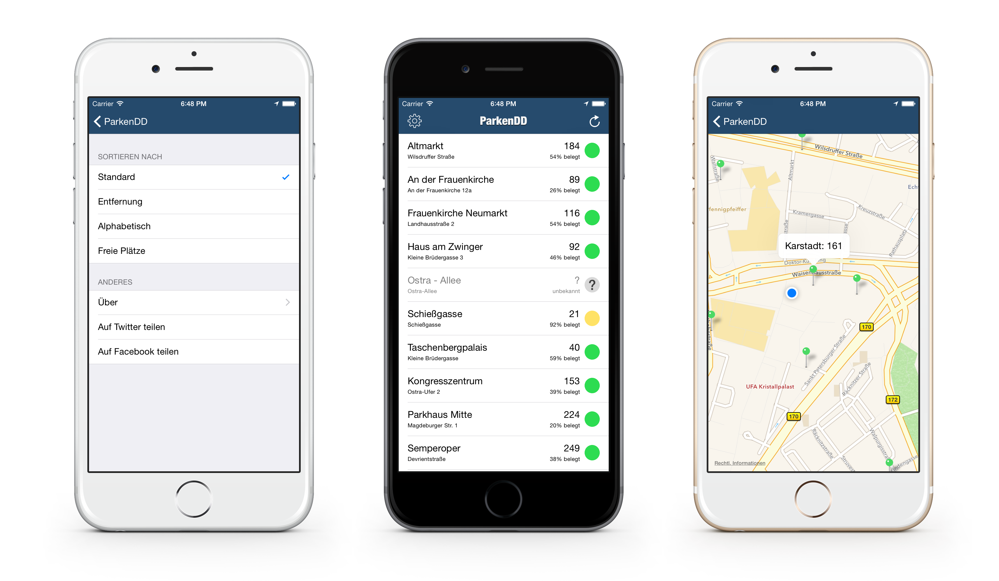

## ParkenDD for iOS

Travis' fault → 

ParkenDD shows you a list of the number of available public parking spots in Dresden, Germany. This information is taken indirectly from the official page at [dresden.de](http://www.dresden.de/freie-parkplaetze/).

If you're using Android have a look at the [original ParkenDD](https://github.com/jklmnn/ParkenDD) from Johannes Kliemann.

Check out [RobTranquillo/parkplaetzeDD](https://github.com/RobTranquillo/parkplaetzeDD) and [jklmnn/ParkenDD-Server](https://github.com/jklmnn/ParkenDD-Server) for the server files that scrape the official site and serve the pretty JSON this app runs on.

Icon on appicon and settings cogwheel made by [Freepik](http://www.freepik.com) from [flaticon.com](http://www.flaticon.com) and are licensed [CC BY 3.0](http://creativecommons.org/licenses/by/3.0/).

**Pull requests and issues are very welcome! Feel free to report any questions or feature requests :)**
